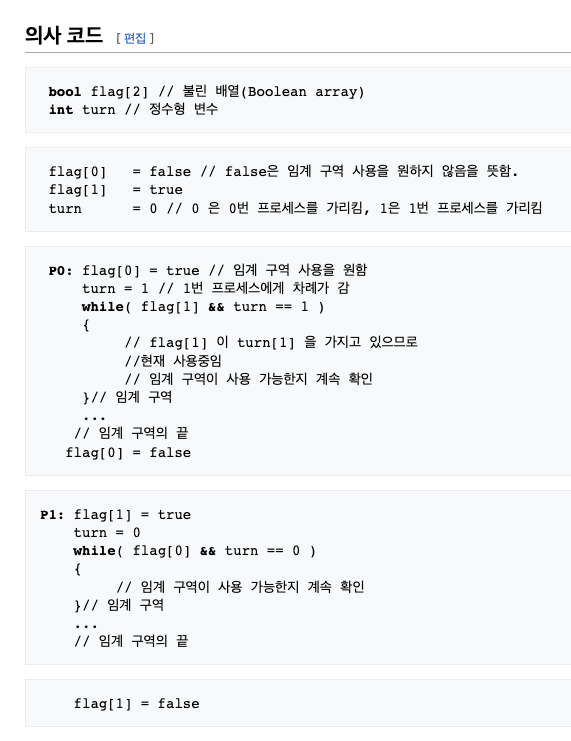

# 17장 타임라인 조율하기

## PreStart

- 16장에서는 Queue를 사용하여 동시성을 제어 + 공유자원의 대한 Handling

<hr/>

## Point

- 동시성 기본형을 만들고,
- "시간"과 관련된 => 로직을 => 함수형 프로그래밍 관점에서 다룬다.

<hr/>

## 좋은 타임라인의 원칙 (p472)

- 타임라인은 적을수록 좋다 => 함수의 순서는 당연히 적을수록 좋다 => 로직자체가 적어져야 한다
- 타임라인은 짧을수록 이해햐기 쉽다 => 로직자체가 짧아야 가독성이 좋다
- 공유하는 자원이 적을수록 이해하기 쉽다 => 공유자원 => 멀티스레딩 => 공유자원의 대한 접근제어 (상호배제...)
- 자원을 공유한다면 서로 조율해야 한다 => Lock, Mutex
- 시간을 일급으로 다룬다 => "시간" 항상 바뀌는 함수 => 액션 => 액션을 다루기 어렵다

```
    타임라인 => 함수의 순서
```

<hr/>

## 버그가 있습니다 (p473)

### 이전에 수정한 기능

    - 16장에서 순서를 보장하면서 로직을 수정
    - 순서보장이 안되는 버그를 수정
    - 좀더 빠르게 하기위한 최적화

### 버그 발생

    - 제품을 하나만 추가해도 가끔 잘못된 합계가 표시된다 => 동시 실행 => 합계 전체 누적

<hr/>

## 코드가 어떻게 바뀌었나요? (p475)

> 최적화 전

```js
function add_item_to_cart(item) {
  cart = add_item(cart, item)
  update_total_queue(cart)
}

function calc_cart_total(cart, callback) {
  var total = 0
  cost_ajax(cart, function (cost) {
    total += cost

    shipping_ajax(cart, function (shipping) {
      total += shipping
      callback(total)
    })
  })
}

function calc_cart_worker(cart, done) {
  calc_cart_total(cart, function (total) {
    update_total_dom(total) // 합계를 변경하는 함수
    done(total) // Queue 종료
  })
}

var update_total_queue = DroppingQueue(1, calc_cart_worker)
```

> 최적화 후

```js
function add_item_to_cart(item) {
  cart = add_item(cart, item)
  update_total_queue(cart)
}

// cost_ajax
// shipping_ajax
// 동시에 실행 => 빠르지만 => 버그가 발생할 여지가 존재
function calc_cart_total(cart, callback) {
  var total = 0
  cost_ajax(cart, function (cost) {
    total += cost
  })

  shipping_ajax(cart, function (shipping) {
    total += shipping
    callback(total)
  })
}

function calc_cart_worker(cart, done) {
  calc_cart_total(cart, function (total) {
    update_total_dom(total)
    done(total)
  })
}

var update_total_queue = DroppingQueue(1, calc_cart_worker)
```

<hr/>

## 버그 수정 (p476 ~ )

1. 액션을 확인하기 (p476)
2. 액션을 그린다 (p477 ~ p480)
3. 다이어그램을 단순화 (p481 ~ 483)
   - 모든 액션자체를 박스 안에 넣는다
   - 액션을 통합한다.
   - 타임라인을 통합한다.
4. 병렬처리를 도입 => 걸리는 시간이 절약된다
5. 모든 병렬 콜백을 기다린다. => 병렬로 처리한다.

<hr/>

## 동시성 기본형 (p487)

- 멀티스레딩을 지원하는 언어 => Mutex, Lock 임계영역을 두는 메서드들이 존재
- JS, Node => 싱글 스레드 => 공유자원의 대한 처리가 없습니다.

```js
function Cut(num, callback) {
  var num_finished = 0

  return function () {
    num_finished += 1
    if (num_finished === num) callback()
  }
}
```

## 동시성 기본형 Cut 적용해보자 (p489 ~ p495)

- Semaphore

```js
function calc_cart_total(cart, callback) {
  var total = 0

  // 재사용성 => js 함수는 일급객체
  // 공유 자원은 2개니까 1개씩 사용한다.
  var done = Cut(2, function () {
    callback(total)
  })

  cost_ajax(cart, function (cost) {
    total += cost
    done()
  })

  shipping_ajax(cart, function (shipping) {
    total += shipping
    done()
  })
}
```

## Javascript 내에서 동시성을 관리하기 위해서는...

- Promise Sereise
  - Promise.all => 병렬로 처리하되, 하나라도 실패하면 로직 실패
  - Proimse.race => 병렬로 처리하되, 먼저 실행되는 애를 반환 (모두 실행은 됩니다.)
  - \*\* Proimse.allSettled => 병렬로 처리하되, 실패 or 성공하는 애들을 각각 Return

```js
const m = 배열.map((it) => executeReturnPromiseFn(it))
await Promise.all(m)
```

## 딱 한번만 호출하는 기본형 (p500)

- Lock, Peterson 알고리즘

```js
function justOnce(action) {
  var alreadyCalled = false
  return function (a, b, c) {
    if (alreadyCalled) return
    alreadyCalled = true
    return action(a, b, c)
  }
}
```



```js
var snedAddToCartTextOnce = justone(sendAddToCartText)
sendAddToCartText(100)
sendAddToCartText(100)
sendAddToCartText(100)
sendAddToCartText(100)
sendAddToCartText(100)
```

- 멱등성이 발생 -> 최초 한번만 효과가 발생

<hr/>

## 암묵적 시간모델 vs 명시적 시간모델 (p503 ~ p508)

- 책참고
