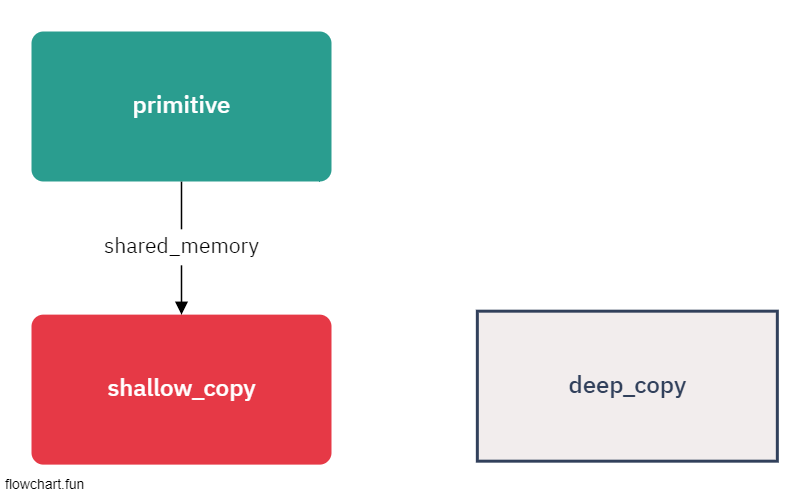

# 신뢰할수 없는 코드를 쓰면서 불변성 지키기

> 레거시 코드의 경우

[add_item_to_cart](./add_item_to_cart.ts)

- 레거시 코드는 Copy-on-Write 방식이 적용이 안되어있음
- 방어적 복사를 사용해야 함 => 결국 깊은복사를 얘기함

> 깊은 복사 vs 얕은 복사

- 두 복사모두 메모리를 따로 할당하는 부분은 같음
- 얕은 복사의 경우 -> 공유되는 메모리가 존재함 (주소복사)
- 깊은 복사의 경우 -> 모든 부분들이 메모리가 할당됨 (값 복사)

- 깊은복사는 아무래도 전체를 복사하기때문에 큰 Object일 경우 비용이 비쌈
