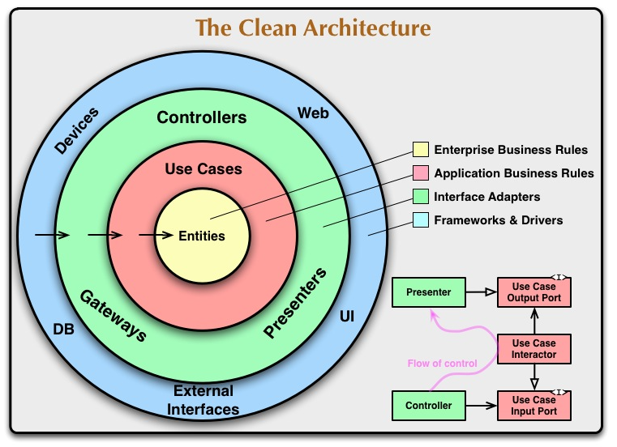

# 계층형 설계

> 계층형 설계가 필요한 이유

- 기본적인 소프트웨어 레벨에서는 추상화 -> 구상화 형태로 발전된다.
- 그러한 관점에서 Layer라는 계층을 둬서 각각의 역할에 집중하게 한다.
- 역할에 집중한다면 설계 및 코드 레벨이 균형을 이룰 수 있다.
- MVC, MVVM, 3, 4 Layer Architecture (Backend), Atomic

> 계층형 설계의 필요한 이론?

- 은근 객체지향 5대원칙이 잘먹힘

> 이책에서 말하는 계층형은 좀더 CodeLevel에 가까운 듯한 내용임

- 코드 레벨에서의 Code Refactoring에 관련된 내용
- 함수는 하나의 성격만 가지게끔...
